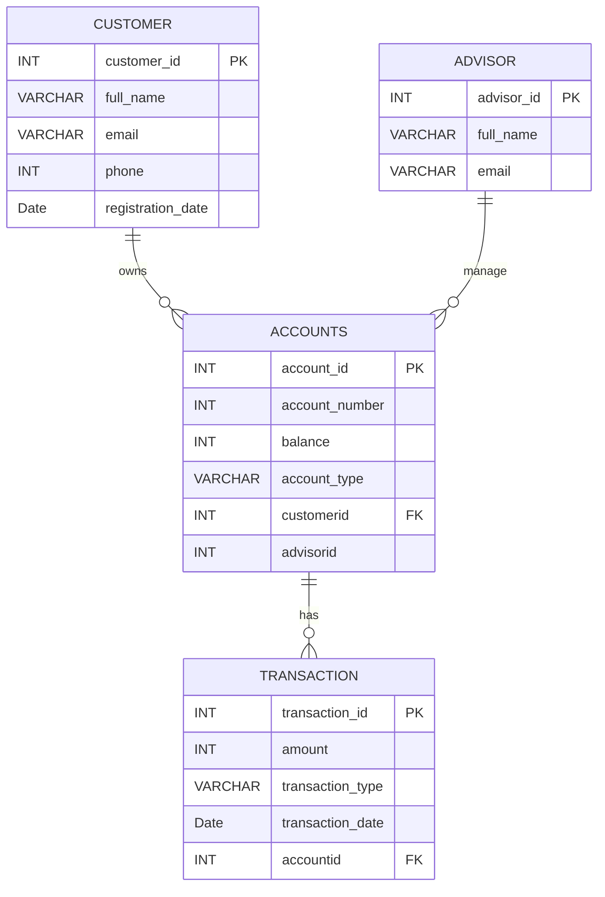

```mermaid
erDiagram
	CUSTOMER {
		INT customer_id PK
		VARCHAR full_name
		VARCHAR email
		INT phone
		Date registration_date
	}
	ADVISOR {
		INT advisor_id PK
		VARCHAR full_name
		VARCHAR email
	}
	
	ACCOUNTS {
		INT account_id PK
		INT account_number
		INT balance
		VARCHAR account_type
		INT customerid FK
		INT advisorid
	}
	
	TRANSACTION {
		INT transaction_id PK
		INT amount
		VARCHAR transaction_type
		Date transaction_date
		INT accountid FK 
	}
	
	CUSTOMER || --o{ACCOUNTS : owns   
	ADVISOR || --o{ACCOUNTS : manage 
	ACCOUNTS || --o{TRANSACTION : has
```

